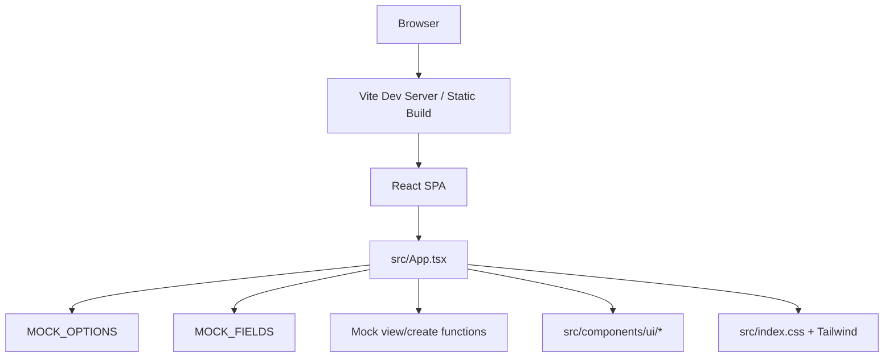
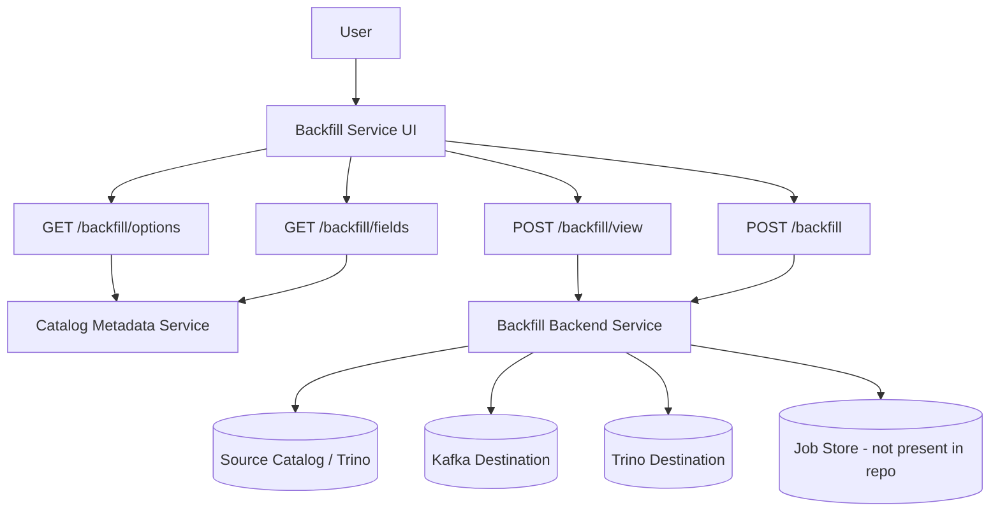
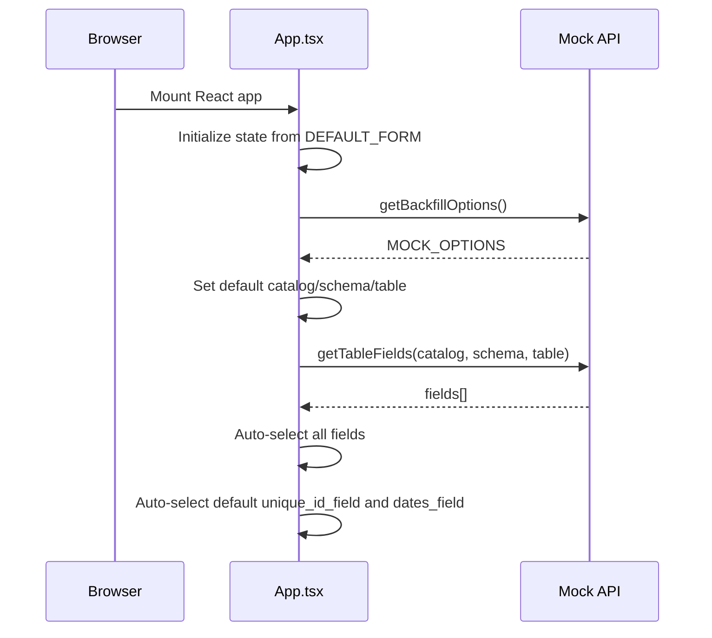
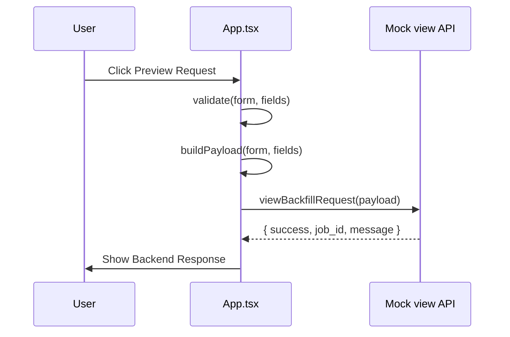
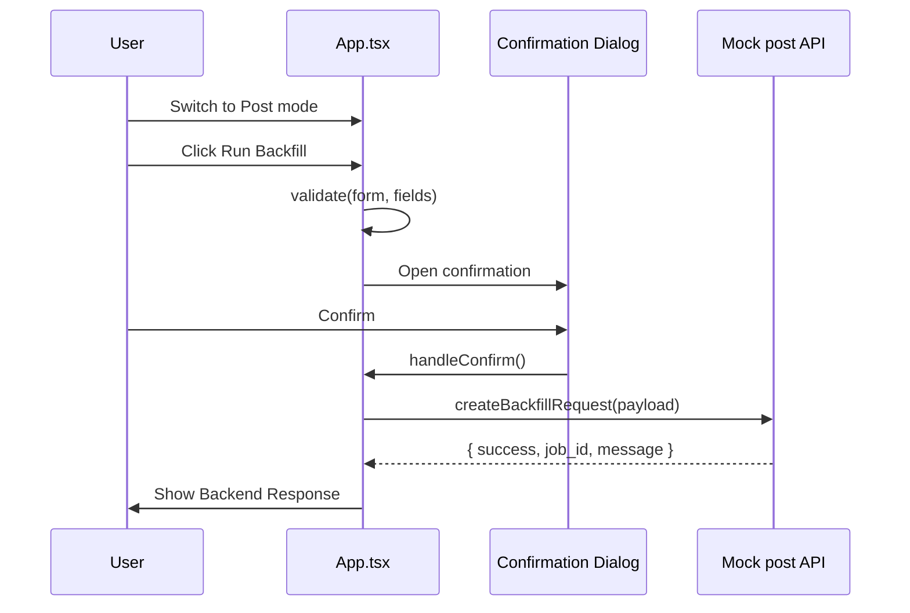

# Project Knowledge: Backfill Service UI

Last generated: 2026-05-17

This document is a self-contained technical summary of the `backfill-service-ui` repository. It is intended for future AI agents and developers who need to understand the application quickly without re-reading the entire codebase.

## 1. High Level Overview

### What The Application Does

`backfill-service-ui` is a single-page React application for creating, validating, previewing, and submitting backfill job requests.

The UI lets a user:

1. Browse available source catalogs, schemas, and tables.
2. Select a source table.
3. Load/select fields from that table.
4. Add custom SQL expressions to the selected fields.
5. Configure a date range and date field.
6. Configure batch size and delay.
7. Choose a destination type: `trino` or `kafka`.
8. Preview the generated JSON request.
9. Submit in either:
   - `view` mode: validation/dry-run style request.
   - `post` mode: execution request that writes data to a destination.

The current implementation uses mock data and mock async functions inside [src/App.tsx](src/App.tsx). There is no real backend integration yet, but the intended API contract is documented in code comments and represented by TypeScript types.

### Business Purpose

The business purpose is to provide an operational interface for running controlled data backfills. A backfill job appears to copy or replay data from a table-like analytical source into a downstream destination such as Kafka or Trino.

The UI is designed to reduce manual JSON editing by giving users a structured form that creates a backend-compatible payload.

### Target Users

Likely target users are:

| User Type | Purpose |
|---|---|
| Data engineers | Configure and launch backfill jobs safely. |
| Backend/platform engineers | Validate request payloads and debug backfill parameters. |
| Operations/SRE users | Run controlled backfill jobs with explicit confirmation before writes. |
| Developers | Test the intended backfill API shape before backend integration. |

### Core Features

| Feature | Status | Notes |
|---|---:|---|
| Catalog/schema/table browser | Implemented with mock data | Displays hierarchical options. |
| Source table selection | Implemented | Uses combo input with known options plus free text. |
| Field loading | Implemented with mock async function | Intended future endpoint: `GET /backfill/fields`. |
| Field selection | Implemented | Checkbox list, search, select all/deselect all. |
| Custom SQL expressions | Implemented | Added directly to `select_fields`. |
| Date range selection | Implemented | HTML date inputs. |
| Date field auto-detection | Implemented | Keyword based: `date`, `time`, `created_at`, etc. |
| Destination selection | Implemented | Supports `trino` and `kafka`. |
| Request preview | Implemented | Live JSON preview plus copy button. |
| View/dry-run mode | Mock implemented | Intended endpoint: `POST /backfill/view`. |
| Post/run mode | Mock implemented | Intended endpoint: `POST /backfill`. |
| Confirmation before write | Implemented | Post mode opens confirmation dialog. |
| Dark mode | Implemented | Toggles `.dark` class on document root. |
| Toast system | Present but not used by main app | Reusable shadcn-style toast files exist. |
| Routing | Not implemented | Single page only. |
| Authentication | Not implemented | No auth code in repo. |

## 2. Full Architecture

### Current Architecture

The current repository is frontend-only.



### Intended Production Architecture

The code comments in [src/App.tsx](src/App.tsx) define the intended API integration:

```text
GET  /backfill/options
GET  /backfill/fields?catalog=&schema=&table=
POST /backfill/view
POST /backfill
```

In production, the architecture is expected to become:



Important: the backend, job store, queues, workers, and real cloud infrastructure are not included in this repository. They are inferred from API names and payload fields only.

### Frontend Responsibilities

The frontend currently owns:

| Responsibility | File/Location |
|---|---|
| Rendering the complete backfill form | [src/App.tsx](src/App.tsx) |
| Holding form state | [src/App.tsx](src/App.tsx), `FormState` |
| Validating required user input | [src/App.tsx](src/App.tsx), `validate()` |
| Building backend payload | [src/App.tsx](src/App.tsx), `buildPayload()` |
| Mocking backend data | [src/App.tsx](src/App.tsx), `MOCK_OPTIONS`, `MOCK_FIELDS` |
| Mocking API calls | [src/App.tsx](src/App.tsx), `getBackfillOptions()`, `getTableFields()`, `viewBackfillRequest()`, `createBackfillRequest()` |
| UI primitives | [src/components/ui](src/components/ui) |
| Styling/theme variables | [src/index.css](src/index.css), [tailwind.config.cjs](tailwind.config.cjs) |

### Request Flow: Initial Load



### Request Flow: View Mode Submit



### Request Flow: Post Mode Submit



### Backend, APIs, Databases, Queues, Cloud Services

Current repository status:

| Area | Implemented? | Details |
|---|---:|---|
| Backend service | No | Only mock functions exist in frontend. |
| Real HTTP API client | No | Comments show future `fetch` calls. |
| Database | No | No schema/migrations/ORM. |
| Queue system | No | No workers or queue libraries. |
| Cloud services | No | No IaC, cloud SDKs, or deployment config. |
| Authentication | No | No login/session/token handling. |
| Object/file storage | No | No storage integration. |
| Cron/background jobs | No | Not in repo. |
| Webhooks | No | Not in repo. |
| Monitoring/logging | No production integration | Only browser UI state and dev logs. |

### Service Responsibilities: Intended

Based on the UI contract, future service responsibilities are likely:

| Service | Responsibility |
|---|---|
| Frontend SPA | Collect user input, validate obvious client-side constraints, preview payload, prevent accidental writes with confirmation. |
| Backfill API | Validate permissions and payload, create backfill jobs, return job IDs and status messages. |
| Metadata API | Return allowed catalogs/schemas/tables/fields. |
| Backfill workers | Execute actual batch reads/writes, handle retries, track progress. |
| Job store | Persist jobs, status, audit history, errors, and metadata. |
| Kafka integration | Publish selected records to configured Kafka topics. |
| Trino integration | Read/write table data or trigger Trino-compatible destination behavior. |

## 3. Tech Stack

### Languages

| Technology | Where | Why |
|---|---|---|
| TypeScript | `src/**/*.tsx`, config files | Strong typing for request payloads, form state, component props, and safer refactors. |
| JSX/TSX | React components | Declarative UI composition. |
| CSS | [src/index.css](src/index.css) | Global Tailwind setup, theme variables, scrollbar styling. |
| HTML | [index.html](index.html) | Vite browser entry point. |

### Runtime and Frameworks

| Technology | Package | Why |
|---|---|---|
| React | `react`, `react-dom` | UI framework for component-based SPA. |
| Vite | `vite`, `@vitejs/plugin-react` | Fast dev server and production bundler. |
| TypeScript compiler | `typescript` | Static type checking and build validation. |

### UI and Styling

| Technology | Package/File | Why |
|---|---|---|
| Tailwind CSS | `tailwindcss`, [tailwind.config.cjs](tailwind.config.cjs) | Utility-first styling and design tokens. |
| Radix UI | `@radix-ui/react-*` packages | Accessible low-level primitives for dialog, select, checkbox, radio, etc. |
| shadcn-style components | [src/components/ui](src/components/ui) | Reusable styled wrappers around Radix primitives. |
| Lucide icons | `lucide-react` | Consistent SVG icon set used throughout the app. |
| `class-variance-authority` | `class-variance-authority` | Component variant styling, especially buttons/badges. |
| `clsx` | `clsx` | Conditional class name composition. |
| `tailwind-merge` | `tailwind-merge` | Avoids conflicting Tailwind classes when composing styles. |
| `tailwindcss-animate` | `tailwindcss-animate` | Animation utilities, especially accordion-style transitions. |

### State Management

| Technology | Usage | Why |
|---|---|---|
| React `useState` | Form state, loading state, errors, dialogs, theme | Local page state is sufficient for this single-page app. |
| React `useEffect` | Initial option load, field load, dark mode class, keyboard easter egg | Side effects tied to component lifecycle. |
| React `useMemo` | Derived schema/table/field lists, payload JSON | Avoids repeated derived calculations. |
| React `useCallback` | Shared setter and easter egg callback | Stable callbacks where useful. |
| React `useRef` | Response scroll target and auto-selection key | Store mutable values that do not trigger render. |

No global state library is currently used.

### Package Managers

| File | Meaning |
|---|---|
| [package-lock.json](package-lock.json) | npm lockfile. |
| [pnpm-lock.yaml](pnpm-lock.yaml) | pnpm lockfile. |

Both npm and pnpm lockfiles exist. `package.json` scripts are package-manager agnostic, but recent dev logs show `npm run build` and `npm run dev` were used.

### Linting and Build Tools

| Tool | File | Why |
|---|---|---|
| ESLint | [eslint.config.js](eslint.config.js) | Static linting for TypeScript and React hooks. |
| TypeScript project references | [tsconfig.json](tsconfig.json) | Splits app and node config type checking. |
| PostCSS | [.postcssrc](.postcssrc) | Runs Tailwind and Autoprefixer. |
| Autoprefixer | `.postcssrc`, dependency | Adds browser CSS prefixes where needed. |

### Not Present

| Category | Status |
|---|---|
| CI/CD | No GitHub Actions or pipeline config found. |
| Testing | No test framework or test files found. |
| Logging | No structured frontend/backend logging library used. |
| Monitoring | No Sentry/OpenTelemetry/etc. |
| Docker | No Dockerfile or compose file. |
| Backend framework | None. |
| ORM/database tooling | None. |

## 4. Frontend Structure

### Folder Structure

```text
backfill-service-ui/
  index.html
  package.json
  package-lock.json
  pnpm-lock.yaml
  vite.config.ts
  tailwind.config.cjs
  .postcssrc
  eslint.config.js
  tsconfig.json
  tsconfig.app.json
  tsconfig.node.json
  src/
    App.tsx
    main.tsx
    index.css
    lib/
      utils.ts
    hooks/
      use-toast.ts
    components/
      ui/
        accordion.tsx
        alert.tsx
        aspect-ratio.tsx
        avatar.tsx
        badge.tsx
        breadcrumb.tsx
        button.tsx
        calendar.tsx
        card.tsx
        carousel.tsx
        checkbox.tsx
        collapsible.tsx
        command.tsx
        context-menu.tsx
        dialog.tsx
        drawer.tsx
        dropdown-menu.tsx
        form.tsx
        hover-card.tsx
        input.tsx
        label.tsx
        menubar.tsx
        navigation-menu.tsx
        popover.tsx
        progress.tsx
        radio-group.tsx
        resizable.tsx
        scroll-area.tsx
        select.tsx
        separator.tsx
        sheet.tsx
        skeleton.tsx
        slider.tsx
        sonner.tsx
        switch.tsx
        table.tsx
        tabs.tsx
        textarea.tsx
        toast.tsx
        toaster.tsx
        toggle.tsx
        toggle-group.tsx
        tooltip.tsx
    assets/
      hero.png
      react.svg
      vite.svg
  dist/
    index.html
    assets/
      index-*.css
      index-*.js
```

### Routing

There is no router. The app is a single page mounted by [src/main.tsx](src/main.tsx).

If routing is added later, likely options:

- `react-router`
- TanStack Router
- file-based routing via a framework migration

### Important Frontend Files

| File | Purpose |
|---|---|
| [index.html](index.html) | HTML shell with `#root`; loads `/src/main.tsx`. |
| [src/main.tsx](src/main.tsx) | Creates React root and renders `<App />` in `StrictMode`. |
| [src/App.tsx](src/App.tsx) | Main application logic and UI. |
| [src/index.css](src/index.css) | Tailwind layers, theme variables, base body styles, scrollbar styles. |
| [src/lib/utils.ts](src/lib/utils.ts) | `cn()` helper for class name merging. |
| [src/hooks/use-toast.ts](src/hooks/use-toast.ts) | Custom in-memory toast state. |
| [vite.config.ts](vite.config.ts) | Vite React plugin and `@` alias to `src`. |
| [tailwind.config.cjs](tailwind.config.cjs) | Tailwind content paths, theme color tokens, radius, animations. |

### Main App Internal Components

All of these are declared inside [src/App.tsx](src/App.tsx):

| Component/Function | Purpose |
|---|---|
| `FieldError` | Displays validation error text with alert icon. |
| `SectionCard` | Standard bordered section wrapper. |
| `SubSection` | Small labeled subsection wrapper. |
| `FormRow` | Label/helper/error wrapper for inputs. |
| `ComboInput` | Text input with filtered dropdown of known options; supports free text. |
| `BackfillOptionsView` | Hierarchical view of catalogs, schemas, and tables. |
| `FieldSelector` | Searchable field checklist plus custom SQL expression manager. |
| `RequestPreview` | Live JSON preview and copy-to-clipboard action. |
| `BackendResponse` | Loading/success/error result display. |
| `App` | Root component, owns all state and event flow. |

### State Model

Primary state type:

```ts
type FormState = {
  catalog: string;
  schema: string;
  table_name: string;
  select_fields: string[];
  custom_select_fields: string[];
  destination_type: "trino" | "kafka" | "";
  kafka_topic: string;
  trino_backfill_key: string;
  dates_start: string;
  dates_end: string;
  dates_field: string;
  dates_isISO: boolean;
  batch_size: number;
  batch_delay_seconds: number;
  unique_id_field: string;
  last_field_group_by: string;
  metro_backfill_url: string;
};
```

Default form values:

```ts
const DEFAULT_METRO_URL = "https://metro-backfill.internal/api/v1/backfill";

const DEFAULT_FORM = {
  catalog: "dataverse",
  schema: "",
  table_name: "",
  select_fields: [],
  custom_select_fields: [],
  destination_type: "",
  kafka_topic: "",
  trino_backfill_key: "",
  dates_start: "",
  dates_end: "",
  dates_field: "",
  dates_isISO: true,
  batch_size: 1500,
  batch_delay_seconds: 1.5,
  unique_id_field: "",
  last_field_group_by: "",
  metro_backfill_url: DEFAULT_METRO_URL,
};
```

### Payload Model

The final backend payload type:

```ts
type BackfillRequest = {
  catalog: string;
  schema: string;
  table_name: string;
  select_fields: string[];
  destination:
    | { type: "kafka"; topic: string }
    | { type: "trino"; backfill_key: string };
  unique_id_field: string;
  last_field_group_by?: string;
  dates: {
    start: string;
    end: string;
    dates_field: string;
    isISO: boolean;
  };
  batch_size: number;
  batch_delay_ms: number;
  metro_backfill_url?: string;
};
```

### Payload Build Rules

Implemented in `buildPayload(form, allFields)`:

1. If no destination type is selected, return `null`.
2. If all known fields are selected and there are no custom SQL expressions, send `select_fields: ["*"]`.
3. If only some fields are selected, send the explicit field names.
4. Append custom SQL expressions to `select_fields`.
5. Convert `batch_delay_seconds` to `batch_delay_ms` using `Math.round(seconds * 1000)`.
6. Include `last_field_group_by` only when non-empty.
7. Include `metro_backfill_url` only when it differs from the default URL.

Example:

```json
{
  "catalog": "dataverse",
  "schema": "public",
  "table_name": "soldiers",
  "select_fields": ["*"],
  "destination": {
    "type": "kafka",
    "topic": "soldiers.backfill"
  },
  "unique_id_field": "soldier_id",
  "dates": {
    "start": "2026-01-01",
    "end": "2026-01-31",
    "dates_field": "created_at",
    "isISO": true
  },
  "batch_size": 1500,
  "batch_delay_ms": 1500
}
```

### Validation Rules

Implemented in `validate(form, allFields)`:

| Field | Rule |
|---|---|
| `catalog` | Required non-empty string. |
| `schema` | Required non-empty string. |
| `table_name` | Required non-empty string. |
| `select_fields` / `custom_select_fields` | At least one selected or custom field is required. |
| `destination_type` | Required. |
| `kafka_topic` | Required when destination is `kafka`. |
| `trino_backfill_key` | Required when destination is `trino`. |
| `dates_start` | Required. |
| `dates_end` | Required. |
| Date ordering | `dates_end` cannot be before `dates_start`. |
| `dates_field` | Required. |
| `unique_id_field` | Required. |
| `batch_size` | Must be at least 1. |
| `batch_delay_seconds` | Must be 0 or greater. |

### Loading and Error States

| State | Implementation |
|---|---|
| Options loading | `optionsLoading`, shown as skeleton rows in `BackfillOptionsView`. |
| Fields loading | `fieldsLoading`, shown as inline loader in Selected Fields section. |
| Fields error | `fieldsError`, shown as destructive inline message; custom SQL still allowed. |
| Submit loading | `submitting`, shown in Backend Response section. |
| Submit error | `submitError`, displayed by `BackendResponse`. |
| Submit success | `submitResponse`, displays `job_id` and message. |

### API Layer

There is no separate API layer file. Mock API functions live in [src/App.tsx](src/App.tsx):

```ts
getBackfillOptions()
getTableFields(catalog, schema, table)
viewBackfillRequest(payload)
createBackfillRequest(payload)
```

The code comments specify these should be replaced with real `fetch` or `axios` calls.

Recommended future refactor:

```text
src/api/backfill.ts
  getBackfillOptions()
  getTableFields()
  viewBackfillRequest()
  createBackfillRequest()

src/types/backfill.ts
  BackfillRequest
  BackfillOptionsResponse
  BackfillFieldsResponse
  BackfillCreateResponse
```

### Toast System

The project includes:

- [src/hooks/use-toast.ts](src/hooks/use-toast.ts)
- [src/components/ui/toast.tsx](src/components/ui/toast.tsx)
- [src/components/ui/toaster.tsx](src/components/ui/toaster.tsx)
- [src/components/ui/sonner.tsx](src/components/ui/sonner.tsx)

Current main app does not use toast notifications. Submit feedback is shown inline in the `Backend Response` section.

### Modals

The app uses `Dialog` from [src/components/ui/dialog.tsx](src/components/ui/dialog.tsx).

Current dialogs:

1. Post confirmation dialog before running a backfill.
2. Hidden easter egg dialog.

### Forms

The form is hand-built using local state and UI primitives. No form library such as React Hook Form is used by `App.tsx`, although a reusable [src/components/ui/form.tsx](src/components/ui/form.tsx) exists.

### Tables and Filters

There is a reusable [src/components/ui/table.tsx](src/components/ui/table.tsx), but the main app does not use it.

Filtering exists inside:

- `ComboInput`: filters dropdown options by typed query.
- `FieldSelector`: filters field checkbox list by search input.

### Theme

Dark mode is controlled by:

```ts
const [dark, setDark] = useState(() =>
  window.matchMedia("(prefers-color-scheme: dark)").matches
);

useEffect(() => {
  document.documentElement.classList.toggle("dark", dark);
}, [dark]);
```

Theme colors are CSS variables defined in [src/index.css](src/index.css) and mapped into Tailwind in [tailwind.config.cjs](tailwind.config.cjs).

## 5. Backend Structure

There is no backend implementation in this repository.

### Current Backend Representation

The backend is represented only by mock functions in [src/App.tsx](src/App.tsx):

| Mock Function | Intended Real Endpoint |
|---|---|
| `getBackfillOptions()` | `GET /backfill/options` |
| `getTableFields(catalog, schema, table)` | `GET /backfill/fields?catalog=&schema=&table=` |
| `viewBackfillRequest(payload)` | `POST /backfill/view` |
| `createBackfillRequest(payload)` | `POST /backfill` |

### Missing Backend Areas

| Area | Status |
|---|---|
| Services | Not implemented. |
| Controllers/routes | Not implemented. |
| Middleware | Not implemented. |
| Authentication | Not implemented. |
| Authorization | Not implemented. |
| Request validation | Only frontend validation exists. |
| Database layer | Not implemented. |
| Queue system | Not implemented. |
| Workers | Not implemented. |
| Retry logic | Not implemented. |
| Caching | Not implemented. |
| Logging | Not implemented. |
| Monitoring | Not implemented. |
| Rate limits | Not implemented. |

### Intended Backend Flow

An eventual backend should probably:

1. Authenticate the user.
2. Authorize access to catalogs/schemas/tables and destinations.
3. Validate request shape server-side.
4. Validate source table and selected fields.
5. Validate destination config:
   - Kafka topic existence/permission.
   - Trino backfill key/source token.
6. In `view` mode:
   - Return a validation result without writing data.
7. In `post` mode:
   - Create a job record.
   - Enqueue execution work.
   - Return `job_id`.
8. Workers should:
   - Read source records in batches.
   - Write to destination.
   - Respect `batch_size` and `batch_delay_ms`.
   - Track progress and errors.

## 6. API Documentation

This section documents the intended API contract inferred from [src/App.tsx](src/App.tsx). The actual repository does not make HTTP requests yet.

### `GET /backfill/options`

Returns available catalogs, schemas, and table names.

#### Auth

Not implemented. Production should require authentication and authorization.

#### Response

```ts
type BackfillOptionsResponse = {
  catalogs: {
    name: string;
    schemas: {
      name: string;
      tables: {
        name: string;
      }[];
    }[];
  }[];
};
```

#### Example Response

```json
{
  "catalogs": [
    {
      "name": "dataverse",
      "schemas": [
        {
          "name": "public",
          "tables": [
            { "name": "soldiers" },
            { "name": "units" },
            { "name": "missions" }
          ]
        }
      ]
    }
  ]
}
```

### `GET /backfill/fields?catalog=&schema=&table=`

Returns fields for a selected table.

#### Query Parameters

| Parameter | Required | Example |
|---|---:|---|
| `catalog` | Yes | `dataverse` |
| `schema` | Yes | `public` |
| `table` | Yes | `soldiers` |

#### Response

```ts
type BackfillFieldsResponse = {
  fields: string[];
};
```

#### Example Response

```json
{
  "fields": [
    "soldier_id",
    "personal_number",
    "first_name",
    "last_name",
    "unit_id",
    "rank",
    "created_at",
    "updated_at"
  ]
}
```

#### Current Mock Error Behavior

If the mock table key does not exist, `getTableFields()` throws:

```text
No fields found for {catalog}.{schema}.{table}
```

In the UI, this does not block custom SQL expression entry.

### `POST /backfill/view`

Validates/previews a backfill request without writing data.

#### Request Body

Same as `BackfillRequest`.

#### Example Request

```json
{
  "catalog": "dataverse",
  "schema": "public",
  "table_name": "soldiers",
  "select_fields": ["*"],
  "destination": {
    "type": "trino",
    "backfill_key": "source-access-token"
  },
  "unique_id_field": "soldier_id",
  "dates": {
    "start": "2026-01-01",
    "end": "2026-01-31",
    "dates_field": "created_at",
    "isISO": true
  },
  "batch_size": 1500,
  "batch_delay_ms": 1500
}
```

#### Response

```ts
type BackfillCreateResponse = {
  success: boolean;
  job_id?: string;
  message: string;
};
```

#### Current Mock Response

```json
{
  "success": true,
  "job_id": "preview_1760000000000",
  "message": "View mode: request validated successfully (no data written)"
}
```

### `POST /backfill`

Creates/runs a backfill job. In the UI, this path is guarded by a confirmation modal.

#### Request Body

Same as `BackfillRequest`.

#### Current Mock Response

```json
{
  "success": true,
  "job_id": "bf_1760000000000",
  "message": "Backfill request created successfully"
}
```

### Error Responses

No real backend error format is implemented. The frontend currently expects thrown errors or failed promises and displays:

```ts
err instanceof Error ? err.message : "Unknown error"
```

Recommended production error response:

```json
{
  "success": false,
  "error": {
    "code": "VALIDATION_ERROR",
    "message": "dates.end cannot be before dates.start",
    "details": {
      "field": "dates.end"
    }
  }
}
```

## 7. Database / Data Model

No database implementation exists in this repository.

### Current Mock Data Model

Mock options are defined in [src/App.tsx](src/App.tsx):

```ts
const MOCK_OPTIONS = {
  catalogs: [
    {
      name: "dataverse",
      schemas: [
        {
          name: "public",
          tables: [
            { name: "soldiers" },
            { name: "units" },
            { name: "missions" }
          ]
        },
        {
          name: "analytics",
          tables: [
            { name: "daily_metrics" }
          ]
        }
      ]
    },
    {
      name: "idf1",
      schemas: [
        {
          name: "operational",
          tables: [
            { name: "events" },
            { name: "activity" }
          ]
        }
      ]
    }
  ]
};
```

Mock fields:

| Table Key | Fields |
|---|---|
| `dataverse.public.soldiers` | `soldier_id`, `personal_number`, `first_name`, `last_name`, `unit_id`, `rank`, `created_at`, `updated_at` |
| `dataverse.public.units` | `unit_id`, `unit_name`, `parent_unit_id`, `commander_id`, `created_at`, `updated_at` |
| `dataverse.public.missions` | `mission_id`, `mission_name`, `unit_id`, `status`, `started_at`, `ended_at`, `created_at` |
| `dataverse.analytics.daily_metrics` | `metric_id`, `metric_name`, `metric_value`, `metric_date`, `created_at` |
| `idf1.operational.events` | `event_id`, `event_type`, `source`, `payload`, `timestamp`, `created_at` |
| `idf1.operational.activity` | `activity_id`, `user_id`, `action`, `activity_time`, `created_at` |

### Business Entities

| Entity | Meaning |
|---|---|
| Catalog | Top-level source data namespace, e.g. `dataverse`, `idf1`. |
| Schema | Namespace inside a catalog, e.g. `public`, `analytics`, `operational`. |
| Table | Source table name. |
| Field | Column or custom SQL expression selected for backfill. |
| Destination | Where backfilled data goes: Kafka topic or Trino destination. |
| Backfill Request | Complete job configuration submitted to backend. |
| Job ID | Identifier returned by backend after validation or creation. |

### Recommended Future Database Tables

Not present, but useful for production:

| Table | Purpose |
|---|---|
| `backfill_jobs` | Store job request, status, timestamps, user ID, mode, destination. |
| `backfill_job_events` | Append-only status/progress/error history. |
| `backfill_job_batches` | Track batch execution progress and retries. |
| `backfill_catalog_permissions` | Authorize user/team access to source objects. |
| `backfill_destination_permissions` | Authorize Kafka/Trino destination access. |

Recommended indexes:

```sql
CREATE INDEX idx_backfill_jobs_created_at ON backfill_jobs(created_at);
CREATE INDEX idx_backfill_jobs_status ON backfill_jobs(status);
CREATE INDEX idx_backfill_jobs_created_by ON backfill_jobs(created_by);
CREATE INDEX idx_backfill_job_events_job_id ON backfill_job_events(job_id);
```

## 8. Environment Variables

No environment variables are currently read by the codebase.

Searches found no use of:

- `import.meta.env`
- `VITE_*`
- `process.env`

### Current Hardcoded Values

| Value | Location | Notes |
|---|---|---|
| `https://metro-backfill.internal/api/v1/backfill` | `DEFAULT_METRO_URL` in [src/App.tsx](src/App.tsx) | Used as an optional backend payload override, not as the frontend API base URL. |

### Recommended Future Env Vars

If real API calls are added:

| Env Var | Required | Example | Purpose |
|---|---:|---|---|
| `VITE_BACKFILL_API_BASE_URL` | Yes | `https://backfill-api.example.internal` | Base URL for `/backfill/*` endpoints. |
| `VITE_AUTH_PROVIDER` | Optional | `oidc` | Frontend auth mode/provider. |
| `VITE_APP_ENV` | Optional | `local`, `dev`, `prod` | Environment label. |
| `VITE_ENABLE_MOCK_API` | Optional | `true` | Toggle mock API during development. |

## 9. Deployment & Infrastructure

### Current Build Process

Build command:

```bash
npm run build
```

This runs:

```bash
tsc -b && vite build
```

Output:

```text
dist/
  index.html
  assets/
    index-*.css
    index-*.js
```

### Current Dev Server

Dev command:

```bash
npm run dev
```

Important: `package.json` has a `predev` script:

```json
"predev": "npm run build"
```

That means `npm run dev` first runs a production build, then starts Vite.

Recent `dev-server.log` showed:

```text
VITE ready at http://127.0.0.1:5173/
```

### Deployment

No deployment configuration exists in this repository.

Possible deployment targets:

| Target | Notes |
|---|---|
| Static web hosting | Suitable because Vite outputs static files. |
| Nginx/Apache | Serve `dist/`. |
| S3 + CloudFront | Common static SPA deployment. |
| Azure Static Web Apps | Viable for static frontend. |
| Vercel/Netlify | Viable for static Vite app. |
| Internal platform | Likely if APIs are internal. |

### Docker

No `Dockerfile` or `docker-compose.yml` exists.

### Secrets

No secrets should be stored in this frontend repo. Any backend tokens should be kept server-side. The UI currently has a `backfill_key` field typed by the user for Trino destination behavior.

Security note: if `trino_backfill_key` is sensitive, avoid logging it, avoid storing it in local storage, and consider masking the input.

### Scaling

Frontend scaling is static file scaling. Real scalability concerns belong to the backend and workers, which are not present here.

### Rollback Strategy

No formal rollback strategy is present. For static deployment, rollback can be achieved by redeploying a previous `dist` artifact or reverting the frontend release.

## 10. Important Decisions

### Frontend-Only Prototype

The project currently implements the full user experience with mock API functions. This allows UI and payload contract development before the backend is wired in.

Tradeoff:

- Pro: Fast iteration, no backend dependency during UI work.
- Con: Comments and implementation may drift from real backend behavior.

### Single-File App Logic

Most business logic and UI are in [src/App.tsx](src/App.tsx).

Tradeoff:

- Pro: Easy to inspect for a small prototype.
- Con: Large file mixes types, mock data, API functions, form logic, and rendering. Future maintainability would improve by splitting files.

### Local React State

The app uses local state instead of a global state library.

Why:

- The app is currently one page.
- State does not need to be shared across routes.
- Form behavior is straightforward enough for `useState`.

### Mock API Instead Of Real HTTP Client

The code has mock async functions with `delay()`.

Why:

- Simulates loading states.
- Makes the UI usable without backend.

Known issue:

- Comments say “React Query” for field loading, but React Query is not installed or used. Field loading is manual with `useEffect`.

### View vs Post Mode

The UI separates dry-run validation from execution:

| Mode | Endpoint | Behavior |
|---|---|---|
| `view` | `POST /backfill/view` | Validate/preview without writing data. |
| `post` | `POST /backfill` | Execute/write data after confirmation. |

Why:

- Prevents accidental data writes.
- Encourages validation before execution.

### Automatic Defaults

When fields load, the app:

1. Selects all fields.
2. Sets default date field using keyword detection.
3. Sets default unique ID field to first field containing `id`.

Why:

- Reduces user effort for common tables.
- Encourages valid payloads quickly.

Risk:

- Heuristic may choose the wrong `id` or date field. User can override.

### Custom SQL Expressions

Users can add arbitrary SQL expressions to `select_fields`.

Why:

- Supports computed fields and casts, e.g. `cast(created_at as timestamp) as created_at`.

Security/validation concern:

- Backend must validate or safely handle these expressions. The frontend sends them as-is.

### `["*"]` Optimization

When all known fields are selected and no custom fields exist, the payload sends:

```json
"select_fields": ["*"]
```

Why:

- Compact representation of “all fields”.

Risk:

- Backend must support this convention.

### Dark Mode Via CSS Class

Dark mode toggles the `.dark` class on `document.documentElement`.

Why:

- Matches Tailwind `darkMode: ["class"]`.
- Simple and framework-independent.

### Current Encoding Issue

Some comments/text in [src/App.tsx](src/App.tsx) appear garbled in terminal output, e.g. box-drawing separators, arrows, ellipsis, and emoji appear mojibaked. The app may still render depending on file encoding/browser handling, but future agents should be careful editing that file.

Recommendation:

- Normalize [src/App.tsx](src/App.tsx) to UTF-8 if needed.
- Avoid unnecessary decorative non-ASCII comments in code.

### Security Considerations

Current risks and notes:

| Area | Concern |
|---|---|
| `trino_backfill_key` | Sensitive token-like field is visible as `type="text"`; consider `type="password"`. |
| Custom SQL expressions | Must be validated server-side. |
| No authentication | Production must authenticate users. |
| No authorization | Production must check access to source data and destinations. |
| Post mode | Confirmation exists, but backend should still enforce permissions. |
| Clipboard copy | Payload copy may include sensitive `backfill_key`. |

### Performance Considerations

Current app is small. Potential future concerns:

| Area | Concern |
|---|---|
| Large field lists | Current checkbox list is not virtualized. |
| Large catalog tree | Current render is simple and may need virtualization/search. |
| Single `App.tsx` | Large re-renders could become harder to optimize. |
| Mock delays | Not relevant in production. |

## 11. Developer Workflow

### Install

Using npm:

```bash
npm install
```

Using pnpm:

```bash
pnpm install
```

Because both `package-lock.json` and `pnpm-lock.yaml` exist, choose one package manager for consistency. Recent logs indicate npm was used.

### Run Locally

```bash
npm run dev
```

This first runs `npm run build` because of the `predev` script, then starts Vite.

Expected local URL:

```text
http://127.0.0.1:5173/
```

### Build

```bash
npm run build
```

This performs TypeScript build checks and generates static assets in `dist/`.

### Preview Production Build

```bash
npm run preview
```

### Lint

```bash
npm run lint
```

### Tests

No test command or test framework exists in `package.json`.

Recommended future setup:

| Test Type | Suggested Tool |
|---|---|
| Unit tests | Vitest |
| Component tests | React Testing Library |
| E2E tests | Playwright |

### Debugging Flow

1. Start dev server with `npm run dev`.
2. Open browser dev tools.
3. Inspect React console errors.
4. For form issues, inspect state transitions in [src/App.tsx](src/App.tsx).
5. For styling issues, inspect Tailwind classes and CSS variables in [src/index.css](src/index.css).
6. For payload issues, use the Request Preview section and copy JSON.

### Common Development Tasks

#### Add a New Destination Type

Files/areas to update:

1. `DestinationType`
2. `BackfillDestination`
3. `FormState`
4. `DEFAULT_FORM`
5. `buildPayload()`
6. `validate()`
7. Destination UI section in `App`
8. Backend API contract

#### Replace Mock API With Real API

Recommended steps:

1. Create `src/api/backfill.ts`.
2. Move types to `src/types/backfill.ts`.
3. Add `VITE_BACKFILL_API_BASE_URL`.
4. Replace mock functions with `fetch`.
5. Handle non-2xx responses.
6. Add loading/error tests.

Example future API helper:

```ts
const API_BASE = import.meta.env.VITE_BACKFILL_API_BASE_URL;

export async function getBackfillOptions() {
  const res = await fetch(`${API_BASE}/backfill/options`);
  if (!res.ok) throw new Error("Failed to load backfill options");
  return res.json();
}
```

#### Add Job Status Tracking

Likely additions:

```text
GET /backfill/jobs/:job_id
GET /backfill/jobs
```

UI additions:

- Job status panel.
- Polling or server-sent events.
- Job history table.
- Retry/cancel controls.

## 12. Future Improvements

### Architecture Refactors

| Improvement | Why |
|---|---|
| Split [src/App.tsx](src/App.tsx) into smaller files | Improve maintainability and reduce cognitive load. |
| Create `src/types/backfill.ts` | Reuse types across API, form, and tests. |
| Create `src/api/backfill.ts` | Centralize HTTP behavior and error handling. |
| Create `src/components/backfill/*` | Separate business components from generic UI primitives. |
| Add config/env layer | Avoid hardcoded backend URLs. |

### Backend Integration

| Improvement | Why |
|---|---|
| Replace mock API functions with real `fetch` calls | Make app production useful. |
| Add auth headers/session handling | Secure API access. |
| Add server-side validation display | Show backend validation errors inline. |
| Add job status polling | Let users track created backfill jobs. |

### UX Improvements

| Improvement | Why |
|---|---|
| Mask `backfill_key` as password/secret input | Reduce accidental exposure. |
| Warn before copying payload with secrets | Prevent leaking sensitive data. |
| Add confirmation summary with destination details | Safer post mode. |
| Add recent jobs/history | Operational visibility. |
| Add saved presets | Faster repeated backfill setup. |
| Add field list virtualization | Better performance for wide tables. |
| Add table search in options tree | Better navigation for many schemas/tables. |
| Add validation summary at top | Easier to find errors in long form. |

### Testing

Recommended tests:

| Test | Purpose |
|---|---|
| `buildPayload()` unit tests | Ensure payload shape is stable. |
| `validate()` unit tests | Ensure client-side validation rules are correct. |
| Field auto-default tests | Verify date/id heuristic behavior. |
| Component tests for post confirmation | Ensure writes require confirmation. |
| E2E happy path | Fill form, preview, submit view mode. |
| E2E post mode | Confirm modal appears before submission. |

### Security Hardening

| Improvement | Why |
|---|---|
| Use `type="password"` for `trino_backfill_key` | Avoid shoulder-surfing/secrets in screenshots. |
| Avoid displaying secret in preview by default | Reduce accidental leakage. |
| Backend authorization by catalog/schema/table | Prevent unauthorized data backfills. |
| Backend authorization by destination | Prevent publishing to unauthorized topics/tables. |
| Audit logging | Backfills can affect critical data flows. |
| Server-side custom SQL validation | Prevent misuse/injection-like issues. |

### Observability

Future production backend should expose:

- Job created count.
- Job success/failure count.
- Batch throughput.
- Retry count.
- Per-destination latency/errors.
- Audit trail by user.

Frontend could add:

- Sentry or equivalent error reporting.
- API latency measurement.
- User action audit events, if required.

## File-by-File Reference

### Root Files

| Path | Purpose |
|---|---|
| [index.html](index.html) | HTML entry shell for Vite app. |
| [package.json](package.json) | Project metadata, dependencies, scripts. |
| [package-lock.json](package-lock.json) | npm dependency lockfile. |
| [pnpm-lock.yaml](pnpm-lock.yaml) | pnpm dependency lockfile. |
| [vite.config.ts](vite.config.ts) | Vite config, React plugin, `@` alias. |
| [tailwind.config.cjs](tailwind.config.cjs) | Tailwind theme and content scanning config. |
| [.postcssrc](.postcssrc) | PostCSS plugins: Tailwind and Autoprefixer. |
| [eslint.config.js](eslint.config.js) | ESLint flat config for TS/React/Vite. |
| [tsconfig.json](tsconfig.json) | Root TypeScript project reference config. |
| [tsconfig.app.json](tsconfig.app.json) | Browser app TypeScript config. |
| [tsconfig.node.json](tsconfig.node.json) | Node/config TypeScript config. |
| [.gitignore](.gitignore) | Ignore dependencies, builds, logs, env files, local settings. |
| [dev-server.log](dev-server.log) | Local dev/build log, not source code. |
| [dev-server.err.log](dev-server.err.log) | Local dev error log, currently empty. |

### Source Files

| Path | Purpose |
|---|---|
| [src/main.tsx](src/main.tsx) | Mounts React app. |
| [src/App.tsx](src/App.tsx) | Main app: types, mock API, validation, payload building, UI. |
| [src/index.css](src/index.css) | Global CSS, Tailwind layers, theme variables. |
| [src/lib/utils.ts](src/lib/utils.ts) | `cn()` helper. |
| [src/hooks/use-toast.ts](src/hooks/use-toast.ts) | Custom toast state manager. |

### UI Component Directory

[src/components/ui](src/components/ui) contains reusable UI primitives. Most are shadcn/Radix-style components. They should generally be treated as shared primitives rather than business-specific code.

Commonly used by `App.tsx`:

| Component | Used For |
|---|---|
| `button.tsx` | Buttons and form actions. |
| `input.tsx` | Text, date, number inputs. |
| `label.tsx` | Input labels. |
| `switch.tsx` | Date ISO/unix toggle. |
| `checkbox.tsx` | Field selection. |
| `radio-group.tsx` | Destination type selection. |
| `skeleton.tsx` | Options loading state. |
| `badge.tsx` | Counts and metadata labels. |
| `separator.tsx` | Section dividers. |
| `select.tsx` | Date field selection. |
| `dialog.tsx` | Confirmation and easter egg modals. |

### Assets

| Path | Purpose |
|---|---|
| [src/assets/hero.png](src/assets/hero.png) | Image asset; not central in current `App.tsx`. |
| [src/assets/react.svg](src/assets/react.svg) | Default React SVG asset. |
| [src/assets/vite.svg](src/assets/vite.svg) | Default Vite SVG asset. |

### Generated/Local Directories

| Path | Purpose |
|---|---|
| `node_modules/` | Installed dependencies; generated. |
| `dist/` | Production build output; generated. |
| `.git/` | Git repository metadata. |
| `.claude/` | Local Claude/Codex tool configuration; not app source. |

## Current Known Gaps

1. No real backend integration.
2. No environment variable support.
3. No auth.
4. No tests.
5. No CI/CD.
6. No Docker/deployment config.
7. No real API error schema.
8. No job history/status tracking.
9. Comments mention React Query but implementation does not use it.
10. Some non-ASCII comments/text appear garbled in terminal output.
11. Sensitive `trino_backfill_key` is plain text in the form and visible in request preview.

## Best Next Step For Future Agents

If asked to continue this project, first determine whether the user wants:

1. UI-only cleanup/refactor.
2. Real API integration.
3. Backend implementation.
4. Tests.
5. Deployment setup.

For most production-readiness work, the highest-value next steps are:

1. Extract API/types from [src/App.tsx](src/App.tsx).
2. Add env-driven API base URL.
3. Replace mock functions with real HTTP calls.
4. Add unit tests for `buildPayload()` and `validate()`.
5. Add auth/error handling based on the real backend contract.

